# Early Detection of Breast Cancer with Artificial Intelligence

**Date: 2020**

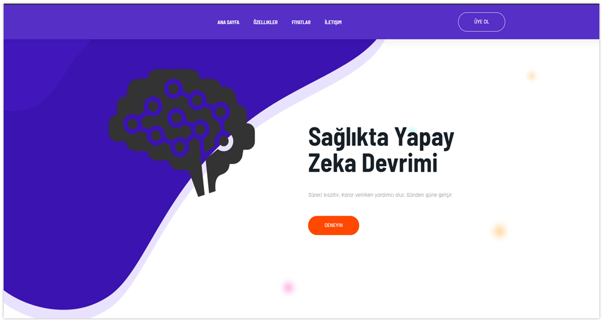

## Table of Content

- [Tools](#Tools)
- [Business Models](#Business-Models)
- [Veri Giriş Aşaması](#Veri-Giriş-Aşaması)
- [Modelleme Aşaması](#Modelleme-Aşaması)
  * [Input Layers](#Input-Layers)
  * [Hidden Layers](#Hidden-Layers)
  * [Output Layers](#Output-Layer)
  * [Sequential](#Sequential)
  * [Dense](#Dense)
- [Aktivasyon Fonksiyonları](#Aktivasyon-Fonksiyonları)
  * [Neden ReLu Fonksiyonu Kullandık](#Neden-ReLu-Fonksiyonu-Kullandık) ?
  * [Tanh Fonksiyonu](#Tanh-Fonksiyonu)
  * [ReLu Fonksiyonu](#ReLu-Fonksiyonu)
  * [Sequential](#Sequential)
  * [Dense](#Dense)
- [Dropout](#Dropout)
- [Learning Rate](#Learning-Rate)
- [Optimizasyon Nasıl Yapılır](#Optimizasyon-Nasıl-Yapılır) ?
- [Loss (Hata) Fonksiyonları](#Loss-Hata-Fonksiyonları)
  * [Mean Squared Error (Ortalama Kare Hatası)](#Mean-Squared-Error-Ortalama-Kare-Hatası)
  * [Logarithm Error Function (Logaritmik hata fonksiyonu)](#Logarithm-Error-Function-Logaritmik-hata-fonksiyonu)
- [Verileri Modele Yerleştirmek](#Verileri-Modele-Yerleştirmek)
  * [epochs](#epochs)
  * [batch_size](#batch_size)
  * [validation_split](#validation_split)
- [Veri Girişi](#Veri-Girişi)
- [Sonuçların Görüntülenmesi](#Sonuçların-Görüntülenmesi)
- [Doğruluk Oranları](#Doğruluk-Oranları)
- [Kaynakça](#Kaynakça)


## Tools

- Python
- Keras
- Scikit-Learn
- Numpy & Pandas
- Django
- Sqlite

## Business Models

- Hedef Ağacı
- Kanvas İş Modeli
- Mantıksal Çerçeve
- Paydaş Analizi
- Problem Ağacı
- Proje Faaliyetleri - Gantt
- Proje Tanıtım Formu
- SWOT Analizi


## Veri Giriş Aşaması

Web Uygulaması aracılığı ile 8 adet veri girişi yapılıyor

- Hücre Boyutunun Düzgünlüğü
- Hücre şeklinin Düzgünlüğü
- Marjinal Yapışma
- Tek Epitel Hücre Boyutu
- Çıplak Çekirdekler
- Uygun Kromatin
- Normal Nikloeller
- Mitoz Sayısı

Bu 8 veriye göre 9. veri olarak tümörün iyi veya kötü huylu olduğu tespit edilmeye çalışılıyor.

Elimizde  8 adet özelliğe bağlı bir giriş katmanımız var, bu 8 katmana göre 1 tane veriyi tahmin etmeye çalışıyoruz.

```python
giris = veriyeni[:, 0:8]
# *giris.shape => (698,8) 8 özelliğe bağlı giriş katmanımız*
cikis = veriyeni[:, 9]
# *cikis.shape => 8 özellikten tahmin ettiğimiz çıkış katmanımız*
```

## Modelleme Aşaması

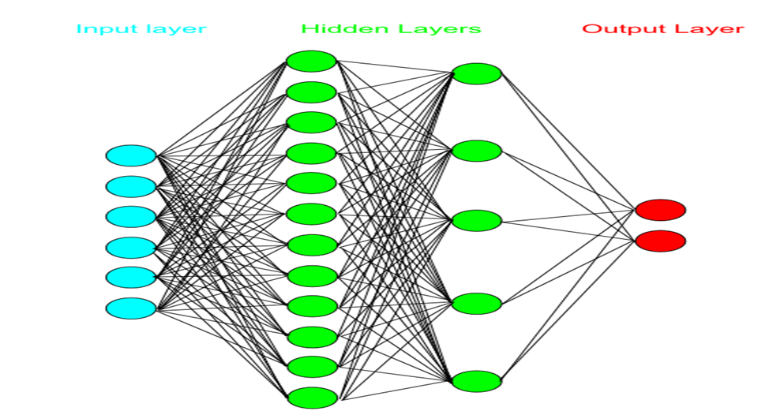

### Input Layers

İlk başta veri setimizi yerleştireceğimiz katman.

### Hidden Layers

Algılayıcılarımızı koyacağımız katman

### Output Layer

Çıkış katmanımız burda ya iyi huylu ya kötü huylu (**2** : İyi Huylu, **4** : Kötü huylu)

### Sequential

Yapay sinir ağları algılayıcıların ardışık olmasına bağlıdır

Çıkış katmanına gidene kadar kendinden öncekine ve sonrakine bağlı bir durumda biz buna ardışık 

fonksiyon diyoruz.

Biz tahminlerimiz de bunu kullanıcaz bunun adı da genel anlamıyla  **multilayer perceptron** deniyor.

```python
model.add(Dense(10, input_dim=8))
```

### Dense

Yapay sinir ağında görülen her ağ kendinden sonraki noktalara bağlı

Input Dimension'a kaç tane özelliğimiz olduğunu yazıyoruz biz 8 özellikten output’u tahmin edeceğiz

## Aktivasyon Fonksiyonları

- **Step Fonksiyonu:** Bir eşik değeri alarak ikili bir sınıflandırma çıktısı (0 yada 1) üretir
- **Sigmoid Fonksiyonu:** En yaygın kullanılan aktivasyon fonksiyonlarından birisidir, [0,1] aralığında çıktı üretir.
- **Tanh Fonksiyonu:** [-1,1] aralığında çıktı üreten doğrusal olmayan bir fonksiyondur.
- **Softmax Fonksiyonu:** Çoklu sınıflandırma problemleri için kullanılan bu fonksiyon, verilen her  bir girdinin bir sınıfa ait olma olasılığını gösteren [0,1] arası çıktılar üretmektedir.
- **Softplus Fonksiyonu:** Sigmoid ve Tanh gibi geleneksel aktivasyon fonksiyonlarına alternatif  olarak sunulan bu fonksiyon (0, +∞) aralığında türevlenebilir bir çıktı üretmektedir.
- **ELU Fonksiyonu:** Üstel lineer birim, negatif girdiler hariç ReLU ile benzerdir. Negatif girdilerde ise genellikle 1.0 alınan alfa parametresi almaktadır.
- **PReLU Fonksiyonu:** Parametrik ReLU olarak geçen bu aktivasyon fonksiyonu da negatif girdiler için extra alfa sabiti ile verilen girdinin çarpım sonucunu çıktı olarak üretmektedir.
- **Swish Fonksiyonu:** Google araştırmacıları tarafından yeni keşfedilen bu fonksiyon girdiler ile sigmoid fonksiyonunun çarpımını çıktı olarak üretmektedir.
- **ReLU Fonksiyonu:** Doğrusal olmayan bir fonksiyondur. ReLU fonksiyonu negatif girdiler için 0  değerini alırken, x pozitif girdiler için x değerini almaktadır.

**ReLU** Fonksiyonunu Kullanacağız.

### Neden ReLu Fonksiyonu Kullandık

Matrislerde sürekli *y = mx + b*  işlemi çalışacağı için çok yüksek veriler elde ediyoruz,

elde ettiğimiz veriyi belli bir değer arasına koymamız lazım bunun için aktivasyon

fonksiyonu kullanıyoruz böylece verilerimizi 0 ile 1 arasına koyuyoruz.

### Sigmoid Fonksiyonu

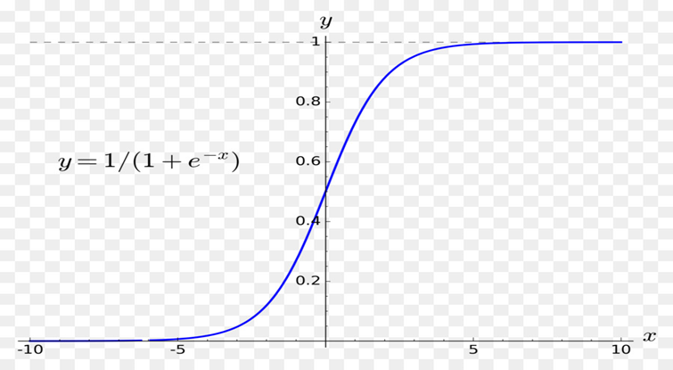

### Tanh Fonksiyonu

.png)

### ReLu Fonksiyonu

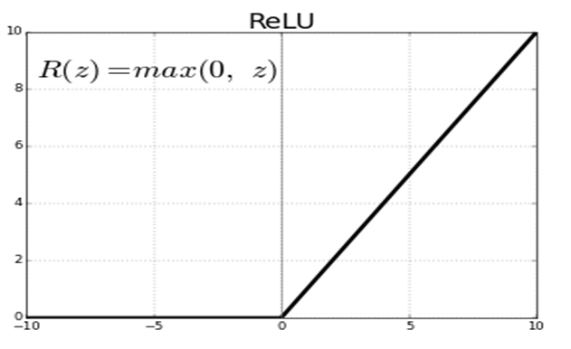

### Softmax Fonksiyonu

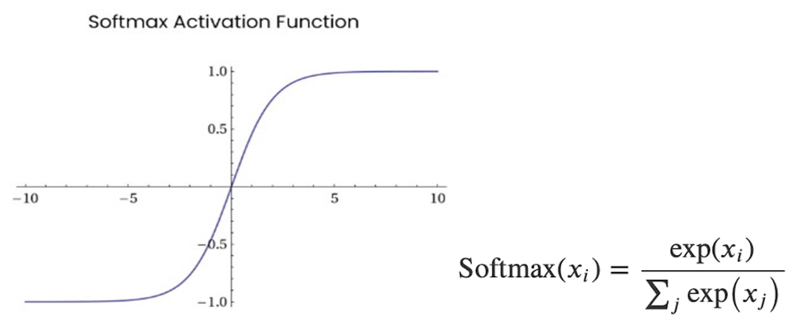

## Dropout

Dropout kullanıp farklı nodeları işleme sokarak veri seti ezberinin önüne geçiyoruz.

Eğer dropout kullanmazsak tahminimiz %100 olur fakat bu ezberlenmiş bir model demektir bizim için makul değer %90-%95.

```python
model.add(Dropout(0.5))

model.add(Dense(10))

model.add(Activation('relu'))

model.add(Dropout(0.5))

model.add(Dense(10))

model.add(Activation('softmax'))
```

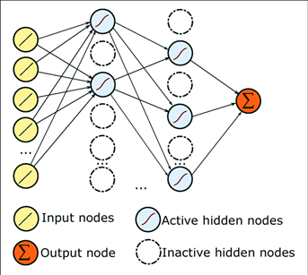

## Learning Rate

**Learning Rate(Lr):** Ne kadar hızlı öğreneceğimizi anlamaya çalışan bir sistem.

```python
optimizer = keras.optimizers.SGD(lr=0.01)
model.compile(optimizer=optimizer, loss='sparse_categorical_crossentropy',
metrics=['accuracy’])
```

Gerçek-tahmini karesini alıp türevini 0’a eşitliyoruz

Algoritmamızın ne kadar doğru ne kadar yanlış yaptığını anlamak için metrics = accuracy ile test

ediyoruz.

## Optimizasyon Nasıl Yapılır

Bu prensibe **Back Propagation Alghorithm** deniyor geriye beslemeli algoritmalar diyebiliriz. 

Yani türevini alıp sıfırlama işlemini geriye doğru yapıyoruz

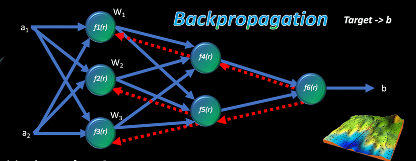

## Loss (Hata) Fonksiyonları

```python
Hata = Gerçek Değer – Tahmini Değer
```

Hata fonksiyonlarında hata fonksiyonunun türevini alıp en hatasız sonuca nasıl ulaşılır onu anlamayaçalışacağız

### Mean Squared Error (Ortalama Kare Hatası)

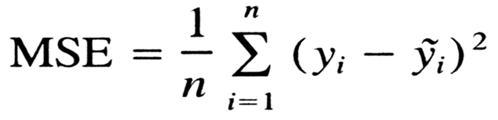

### Logarithm Error Function (Logaritmik hata fonksiyonu)

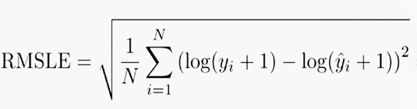

## Verileri Modele Yerleştirmek

Modelimiz bitti şimdi bu verileri modele yerleştirmek kaldı

```python
model.fit(giris, cikis, epochs=10, batch_size=32, validation_split=0.20)
```

### epochs

Veri setini ayrı ayrı 10 kere tarayacak

### batch_size

Aynı anda kaç bitlik işlemi hafızaya alacağını belirtiyoruz.

### validation_split

Doğrulama kısmı. Bütün verimizin bir kısmını yapay sinir ağımıza yerleştirelim

Elimizde kalan sinir ağına sokmadığımız işlenmemiş veriyi veri setine sokarak tahmin etmesini sağlayacağız. Eğer tamamıyla işleme sokarsak model verileri ezberler. Bizim amacımız görmeden tahmin 

etmesi.

```python
tahmin = np.array(
  [
    uniformity_cell_size,
    uniformity_cell_shape,
    marginal_adhesion,
    single_epithelial_cell_size,
    bare_nuclei,
    bland_chromatin,
    normal_nucleoli,
    mitoses
 ]
).reshape(1, 8)
```

## Veri Girişi

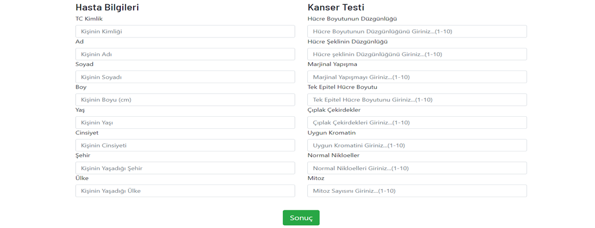

## Sonuçların Görüntülenmesi

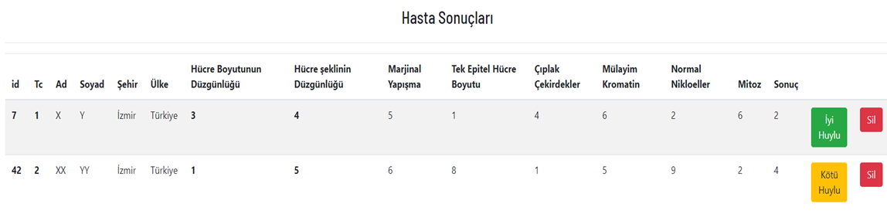

## Doğruluk Oranları

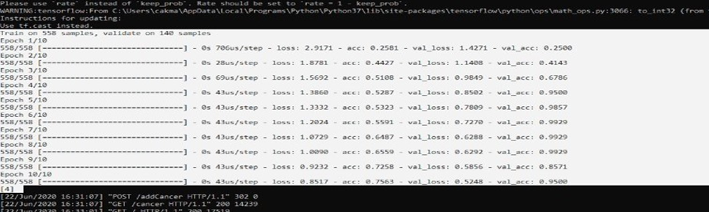

**acc:** Doğruluk oranlarımız

**val_acc:** Ayırdığımız veri setinin doğruluk oranı

**val_loss:** Türev fonksiyonlarındaki değerlerin toplamı

## Kaynakça

**Veri Setlerini Edindiğimiz Kaynak**

UC Irvine Machine Learning Repository

**Yapay Zekaya Öğrettiğimiz veri seti**

[https://archive.ics.uci.edu/ml/datasets/breast+cancer+wisconsin+(original)](https://archive.ics.uci.edu/ml/datasets/breast+cancer+wisconsin+(original))

**İndirme Linki**

[https://archive.ics.uci.edu/ml/machine-learning-databases/breast-cancer-wisconsin/](https://archive.ics.uci.edu/ml/machine-learning-databases/breast-cancer-wisconsin/)

[https://keras.io/api/layers/activations/](https://keras.io/api/layers/activations/)[https://keras.io/api/losses/](https://keras.io/api/losses/)

[https://keras.io/api/optimizers/](https://keras.io/api/optimizers/)[https://ruder.io/optimizing-gradient-descent/index.html#momentum](https://ruder.io/optimizing-gradient-descent/index.html#momentum)

---

*All Right Reserved  Yiğit Çakmak*

